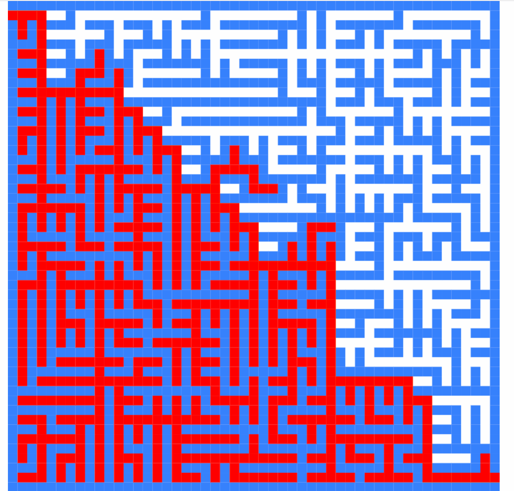
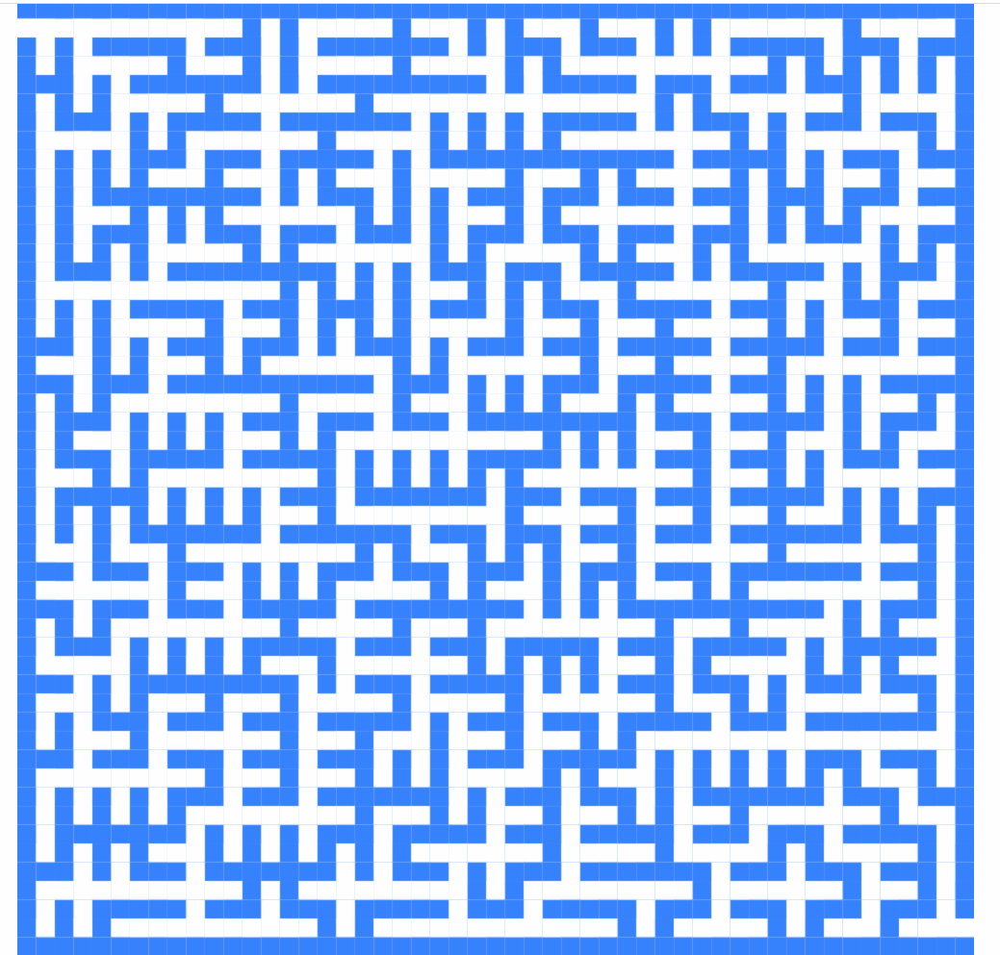

# Visualization Solution for Maze Problem

Hi guys.

The maze problem is a classic algorithm problem in computer science. But it is somewhat complicated, and difficult to understand.

In order to help everyone better understand the relevant algorithms, I did this visualization project.

This project includes the following content:

- Maze-Solving algorithm and it's visualization
  
  Online Link1: https://bytefishmedium.github.io/MazeGame/solution/DFS-Recursive/MazeSolver.v7.html
  
  Online Link2: https://bytefishmedium.github.io/MazeGame/solution/DFS-Iterative/MazeSolver.v3.html

  

- Maze-Generating algorithm and it's visualization 
  
  Online Link: https://bytefishmedium.github.io/MazeGame/generator/4-BFS/MazeGenerator.v3.html
  
   
  
- Tiny maze game

   https://bytefishmedium.github.io/MazeGame/game/MazeGame.v2.html

## TECHNOLOGY:
- JavaScript
- HTML Canvas
- Deep first search algorithm and breadth first search algorithm

## Project Structure
If you intend to read this project, you can read it in this order:

- ./maze_files
  
  In this folder, I have provided some basic maze files to do subsequent materials.

- ./render
  
  Rendering some maze using Canvas.

- ./solution
  
  Maze solve and visualization

- ./generator
  
  Generate maze and visualization

- ./game
  
  Finally, I add some small features and turn it into a small game.
